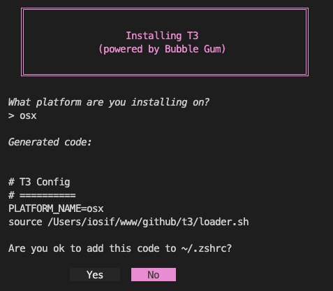

# t3
Terminal Toolbelt Two

## Installation

### Install Gum
Link to their [github repo]([here](https://github.com/charmbracelet/gum))

### Clone this repo
```bash
cd ~ && mkdir www && mkdir www/github && cd www/github/
git clone git@github.com:iosifv/t3.git
```

### Use install script

```bash
sh t3install.sh
```




### Todo List
- [x] Load all files from a folder with a for loop
- [x] Create separate folders for every OS
- [ ] Name every variable with prefix `T3_`
